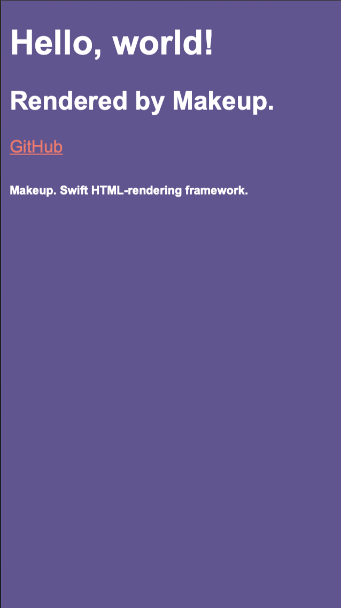

# Makeup 💋

> _(See `develop/release` brunch for the most relevant codebase.)_

<p>
    <a href="https://www.bitrise.io">
        
    </a>
    <a href="https://swift.org">
        
    </a>
    <a href="https://swift.org/package-manager">
        
    </a>
    
    <a href="https://twitter.com/maximkrouk">
        
    </a>
</p>

Swift DSL for rendering HTML. Not the first, but the best (will become, one day... 😌)

## Usage

```swift
// Swift
document {
    html {
        head {
            title("My first Site")
        }
        body {
            header {
                h1("Hello, world!")
            }
            main {
                h2("Rendered by Makeup.")
                a("GitHub")
                    .href("https://github.com/maximkrouk/Makeup")
                    .foreground(color: .livingCoral)
            }
            footer {
                h6("Makeup. Swift HTML-rendering framework.")
            }
        }
        .font(name: .arial)
        .foreground(color: .white)
        .background(color: .ultraviolet)
    }
}
```

is rendered to:

```html
<!DOCTYPE HTML>
<html>
    <head>
        <title>
            My first Site
        </title>
    </head>
    <body style="font-family:'arial';color:rgba(255.0,255.0,255.0,255.0);background-color:rgba(100.0,83.0,148.0,255.0);">
        <header>
            <h1>
                Hello, world!
            </h1>
        </header>
        <main>
            <h2>
                Rendered by Makeup.
            </h2>
            <a href="https://github.com/maximkrouk/Makeup", style="color:rgba(250.0,114.0,104.0,255.0);">
                GitHub
            </a>
        </main>
        <footer>
            <h6>
                Makeup. Swift HTML-rendering framework.
            </h6>
        </footer>
    </body>
</html>
```

and looks like:




## Installation

Add the package to Your SwiftPM package dependencies:

```swift
.package(url: "https://github.com/MakeupStudio/Makeup.git", from: "0.2.1")
```

then add `Makeup` dependency to your target.

## Still in Beta

> _Not recommended for production use before the first release, but you are welcome to test it out_ 😉

__Calendar:__

- ✅ Basics (Nodes, Attributes, some CSS)
- ✅ Assets (WebColor, WebSize, Webfonts)
- ✅ Preparations for semantic filtering
- ✅ Function Builders
- ✅ Html building functions
- ✅ String literal support
- ✅ Rendering
- ⏱ NodeWrapper attibutes modification via suffixed methods _(dot-notation like in the __Usage__ example)_
  - December 2019 - Janruary 2020

- 🗳 Xcode documentation in sources
  - December 2019 - Janruary 2020

- ⏱ Git-flow
  - December 2019 - Janruary 2020

- ⏱ First release (API v1, static pages & simple sites production ready) _(1.0.0)_
  - Janruary 2020

- 🗳 Contribution guide with explanations of the package architecture
  - December 2019 – Janruary 2020

- 🗳 Attributes extended support _(via static factories)_
  - January 2020

- 🗳 API v2 _(2.0.0)_
  - February 2020

- 🗳 External docs & Examples
  - Up to May 2020

- 🗳 Testing
  - Up to May 2020

- 🗳 API v3 _(3.0.0)_
  - May - June 2020
- Other
  - 🗳 SVG support
  - 🗳 Drawing engine, based on SVG
  - 🗳 XML support
  - 🗳 MD support
  - 🗳 Syntax highlighting
  - 🗳 Swift grammar for syntax highlighting
  - 🗳 JS support
  - 🗳 CSS extended support
  - ⏱ Extracting colors into another library _(GenericColors)_

---

✅ - Done

⏱ - In progress

🗳 - Waiting

## Sites using Makeup

**[mxswift](https://mxswift.herokuapp.com)**

## Thanks for inspiration and ideas

<div>
  <!-- --------------------- pointfree.co --------------------- -->
  <p>
  <a href="https://github.com/pointfreeco">
  
  </a>
  <a href="https://github.com/pointfreeco/swift-html">
  
  </a>
  <a href="https://twitter.com/pointfreeco">
        
    </a>
</p>
  <!-- --------------------- David Okun --------------------- -->
  <p>
  <a href="https://github.com/dokun1">
  
  </a>
  <a href="https://github.com/dokun1/vaux">
  
  </a>
  <a href="https://twitter.com/dokun24">
        
    </a>
</p>
  <!-- -------------------- John Sundell -------------------- -->
  <p>
  <a href="https://github.com/johnsundell">
  
  </a>
  <a href="https://github.com/johnsundell/plot">
  
  </a>
  <a href="https://twitter.com/johnsundell">
        
    </a>
</p></div>

----

> _You may contact me [here](https://twitter.com/maximkrouk) if You want to contribute before the guide is provided or if You have any other questions or ideas._

